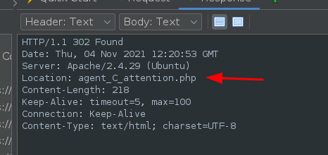
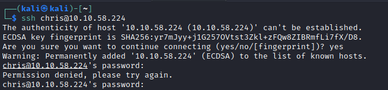
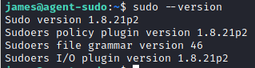

# Agent Sudo

Room Description: You found a secret server located under the deep sea. Your task is to hack inside the server and reveal the truth.

We can see a few ports open

I'll browse to the http port to see what the site is about.

We get a hint here about changing the codename as user-agent. And agent R sent this.

I'll send this over to ZAP and see what happens when we start changing the user-agent.

First I'll try agent R as per the web-page.

Our response is different now, so we're on the right track!

Considering it is 1 letter, I can try fuzz this with the alphabet.

I've setup some payloads from A-Z in caps.

We got a different looking response for C as the agent user.

We have a redirect here:

Browsing to this gives us some more information!

Looks like chris has a weak password.

Attempting to browse to agent J as above didn't provide any further details. So I'll try an brute force now against FTP as the room suggests. I'll assume the username is chris.

Using hydra we find a password! crystal.

Now to login and have a look.

We can see some files in the ftp login

I also tried chris' credentials for ssh - but no avail.

I downloaded all the files with the FTP command `mget *`

Looking at the 'To_agentJ.txt' file we have some information that mentions J's password is in a picture.

Now lets check out the images.

So we have two cute looking aliens

Since we know that something is stored in one of the images we can look into that with the tool 'steghide', which I installed using ATP.

This site is useful https://0xrick.github.io/lists/stego/ 

So we certainly have something here in the first image, we just need a passphrase, I'll check the next image. The second image is a PNG which is not supported. Looking at the site above, there is a tool for PNG called foremost.

Looks like we might have something here too...

So we've extracted a zip file from the png!

Looks like the zip file is password protected, I can try and brute force this.

Using John we run a brute force with our password list.

Looks like we have a hit!

Extracting the zip gives us another file / clue

The string above in the message doesn't decrypt the other image, however after some playing with the Burp decode, it turns out it's Base64 encoded.

Here we have a potential password: Area51

Bingo! That decrypted the JPG steg image.

So now to extract and view the file.

Looks like we have a password for james!

I'll try this on ssh.

So we're in as james now!

We can see the user flags here:

The image in the folder is of the roswell alien autopsy ;)

Next I'll see what james can do as sudo (if anything)

Looks like we can only run /bin/bash as sudo, but not as root. 

Let's check the sudo version.

Looks like we have a potential hit here! 

Reviewing the exploit here: https://www.exploit-db.com/exploits/47502 we have some things to try.

We can enter this command `sudo -u#-1 /bin/bash`

Which exploits this vulnerability.

Now we are root!

And for the flag:

We're done!