# Overpass

Description: What happens when some broke CompSci students make a password manager?

A quick scan shows us two open ports. 22 and 80.

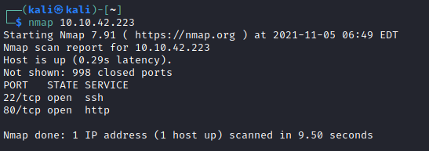

There is a website accessible on the machine.

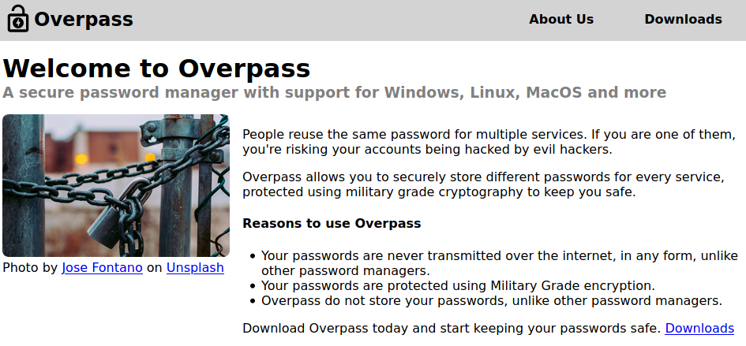

While I click around the site, I'll kick of a gobuster scan for hidden folders.

We're getting some hits right away, downloads, admin etc.

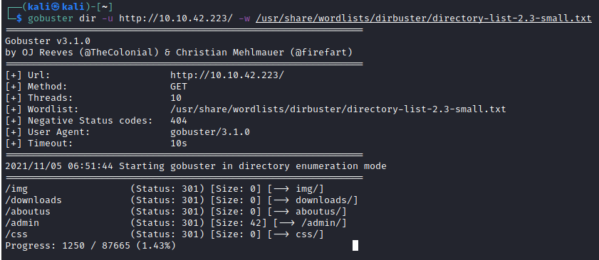

There is an admin page here with a login. It also looks like the username might be 'administrator'.

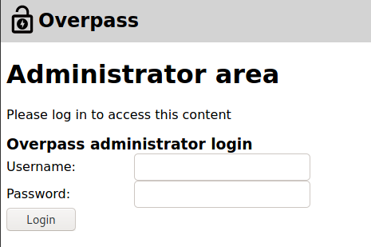

I'll fire up burp and see what the login request looks like.

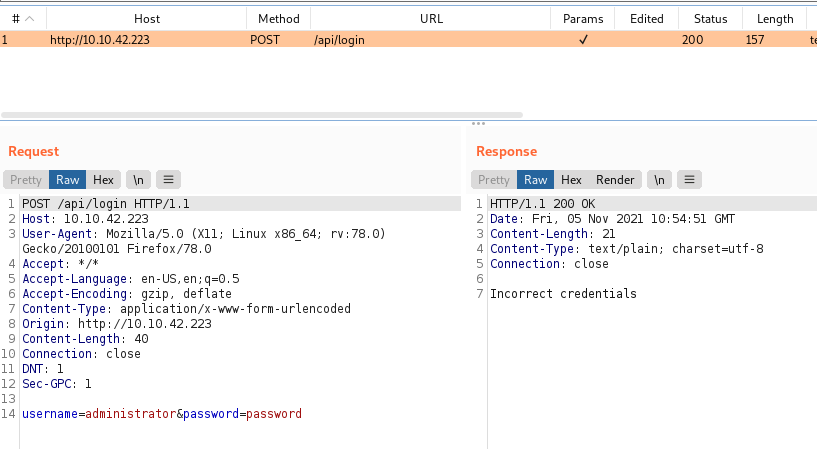

It looks like there is an API folder as well. I'll try some SQL injections to see what we get. The normal payloads of `'--` and `'-- or 1=1` didn't yield any results or errors. I could try fuzzing some SQL injection payloads, but will look around the site a bit more first.

Looking in the source code of the login page we see some js files that look interesting.

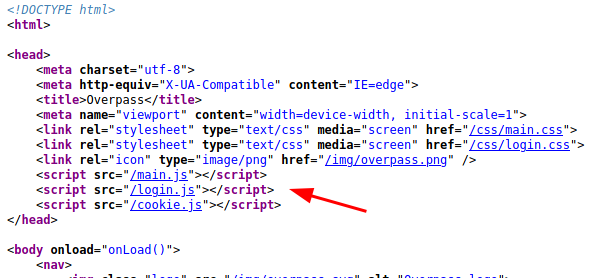

Looking at the js file it looks like it is looking for a specific string response from the server to deny a login.

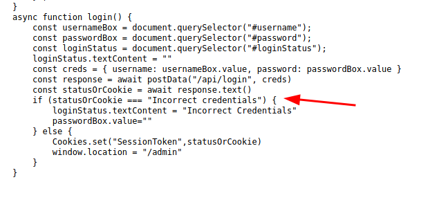

So if we can change this response from the server to the browser, we might be able to login.

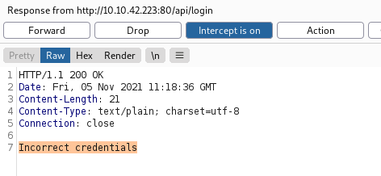

I changed the text to 'ok', and forward it to the client and we got further access!

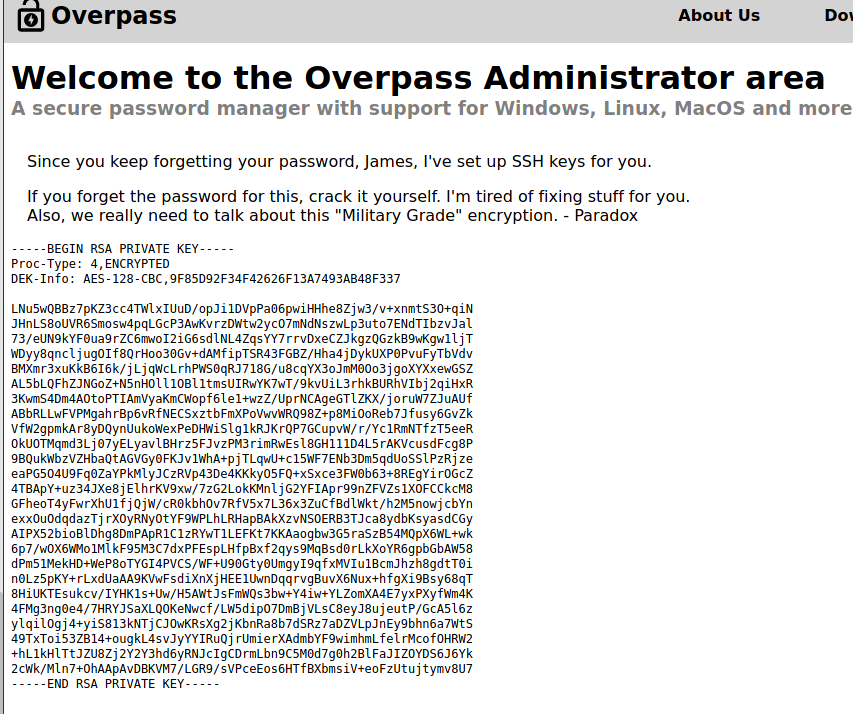

Looks like this might be James's ssh login key, but it is password protected. I'll try to crack it with John.

First I've downloaded the key and tested ssh with it:

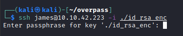

We can see it's asking for a password. Now over to John.

First I'll covert it to a suitable format for john.

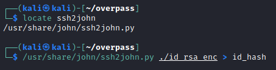

Now run the crack with rockyou.txt

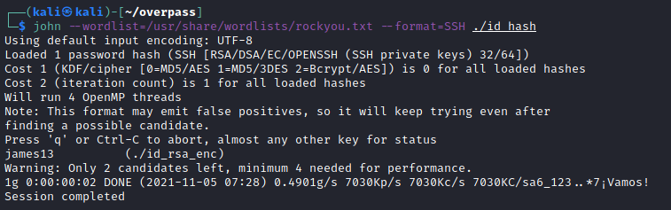

Looks like we have a hit 'james13'.

Now we're in ssh as james!

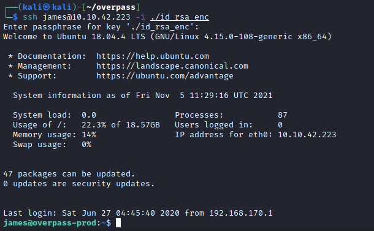

So we have out first flag, and a possible hint?

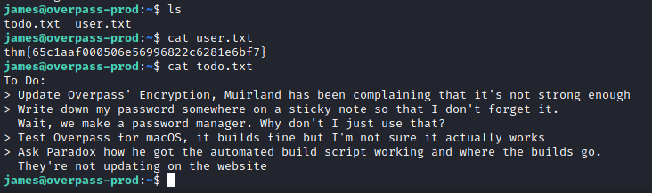

Looks like they're using their application for the password manager, I can see an overpass file in the user's files.

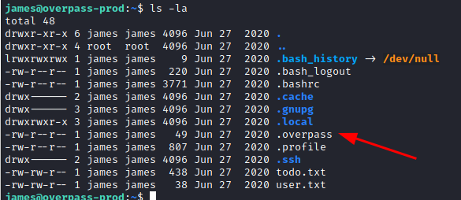

I'll have a look at the source code for their app, which is available on their website!

Looking at this function, it may be encrypting with a rot47

In the user's overpass file we can see the encrypted code.

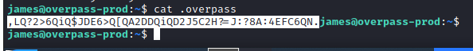

Now to try and decrypt it, this site is helpful https://rot47.net/

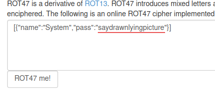

Here we have some new things to try!

The password above worked for james's account! So I tried it with sudo, but James doesn't have access to sudo.

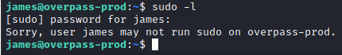

Next I looked for SUID bit files, but didn't see anything useful.

The todo hint talks about some automated script building something, so maybe I need to look into that. A common method for automated scripts is cron.

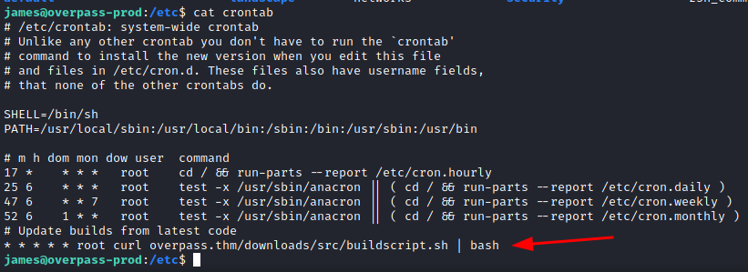

Looking at the crontab file I can see that a script is updated regularly. I tried to find the www folder in the server but it must be in a protected folder.

But the cron job grabs the file from overpass.thm. Perhaps I can exploit this, if I can change the dns resolver to my own webserver and pass it a reverse shell code - I should be able to get in as a root shell.

This is interesting, the hosts file has write access!

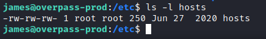

Now I'll try this out. 

I'll make a reverse shell payload with netcat

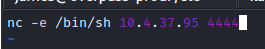

Put it in a folder nested under downloads/src/ and share that root folder on an python webserver. Using the same naming convention as the cron job.

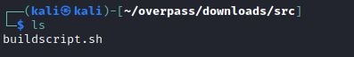

Now to load the server.

Finally we change the host file, pointing the overpass.thm to my IP.

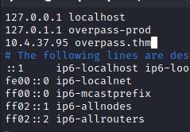

Now we wait...

This is working, I got a hit on my server.

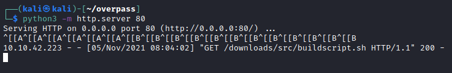

But the reverse shell didn't load on my nc listener. Maybe the version of nc on the server doesn't support the -e flag.

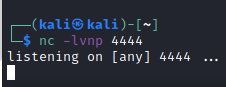

I'll try a different payload / reverse shell in my http server script.

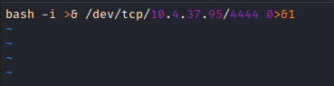

That one worked! :D

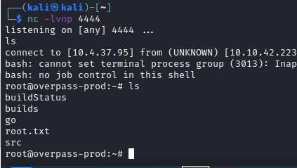

I am (g)root!

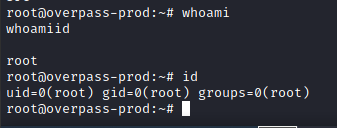

Now for the flag.

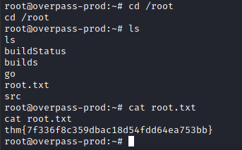