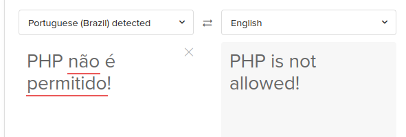

#RootMe Room

Another TryHackMe box, we need to try and get root on this device. It appears to be a Linux machine based on the description.

## Tools

- Kali Linux
- Nmap
- GoBuster
- OWASP ZAP
- PHP Reverse Shell
- Python

## Recon

I'll start with an NMAP scan using the default script and -sV to get any version information on the services running.

We have two ports open, ssh and http.

There is a website setup:

The source of this page doesn't provide much.

I'll try gobuster to see if there are any interesting folders we can find.

It found some interesting folders. Uploads and panel.

## Exploitation

Panel brings me to an upload portal, which is a good place to try my reverse PHP shell.

PHP uploads are blocked, so I will try to determine what files are allowed.

Using OWASP ZAP Fuzzer tool I'll try several alternative PHP related extensions.

That seemed quite successful,quite a few extensions were allowed except php.

Here is the response of the phtml, I'm guessing successo means success! ;)

I can see it has been uploaded to the /uploads folder.

Now Ill try and run the script while having an NC listener active.

Successo! We have a reverse shell:

We can see my OWASP ZAP attack uploaded several reverse shells here:

First I'll upgrade from the simple shell with `python -c 'import pty; pty.spawn("/bin/bash")'`

Now let's look for a user flag.

Here it is:

## Privilege Escalation

Now for privilege escalation, I'll start by searching for SUID files.

Python looks interesting

After some research the site below advises a way to priv escalate with python

https://gtfobins.github.io/gtfobins/python/

This should do it `python -c 'import os; os.execl("/bin/sh", "sh", "-p")'`

And now we have it! My effective ID is root!

Now for the flag

