# Steel Mountain

Description: Hack into a Mr. Robot themed Windows machine. Use metasploit for initial access, utilise powershell for Windows privilege escalation enumeration and learn a new technique to get Administrator access.

## Employee of the month

The first question is to find the employee of the month. There is a photo on the main page. The source code shows the file name which gives us the employee's name ;)

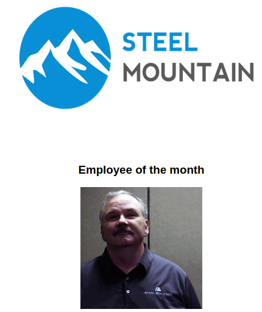

## Initial Access

I'll start off with nmap.

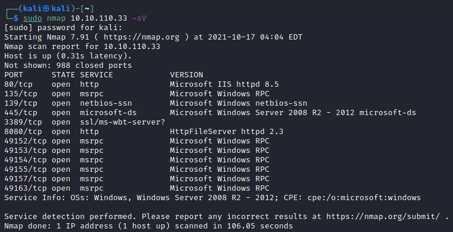

Here we can see what's running on the machine, including service versions.

There is another web server on port 8080, looks like a file server. Let's check it out!

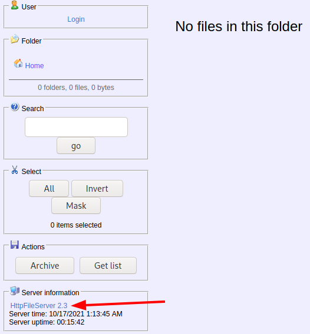

This nmap scan and link from the web server gives us the answer's to the next few questions.

Now to look for an exploit.

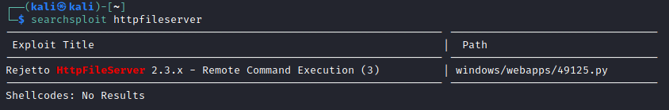

Looks like this version is vulnerable to RCE! We should be able to take advantage of this.

Note the CVE info is available here: https://www.exploit-db.com/exploits/39161

Now over to metasploit, here we can see the exploit, I'll try this one.

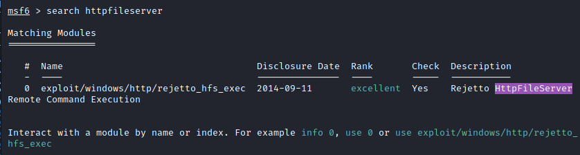

Now I've setup the exploit with the appropriate details

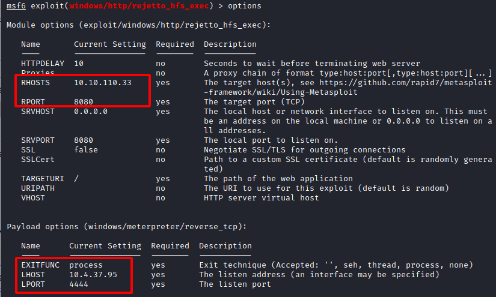

We run the exploit and...

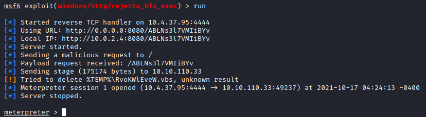

we have a meterpreter shell!

I've now opened a os shell, hunted around the server, and found the first user flag.

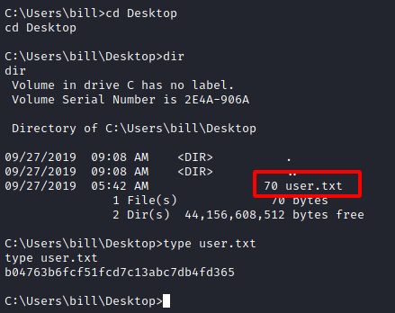

## Privilege Escalation

Now we'll try to escalate our privileges on this machine.

First I tried my luck with the built in metasploit option 'getsystem' but this failed.

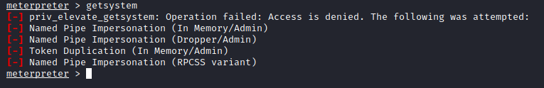

So I'll look for other options. The room advises us to try a PowerUp script, so I'll get that and check it out.

I've downloaded it, put it on my desktop and uploaded it with my meterpreter shell.

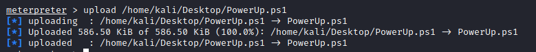

Now I'll load powershell

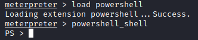

Now to run the script.

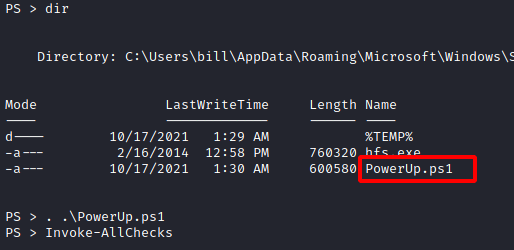

So we have some interesting info here about this service. This services appears vulnerable: AdvancedSystemCareService9

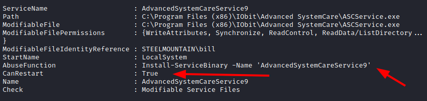

Since we can restart this service, and write to the folder in it's path and the path being used is non quoted, we could replace this executable with a payload.

I've now made a reverse shell payload which I'll upload using the same process as before with meterpreter.

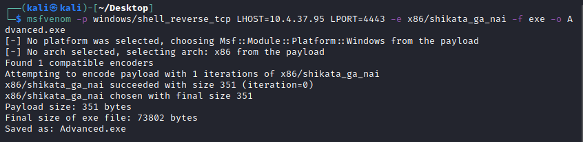

Here is the file uploaded and copied to the appropriate location, now to move it to our service file, setup our listener and restart the service.

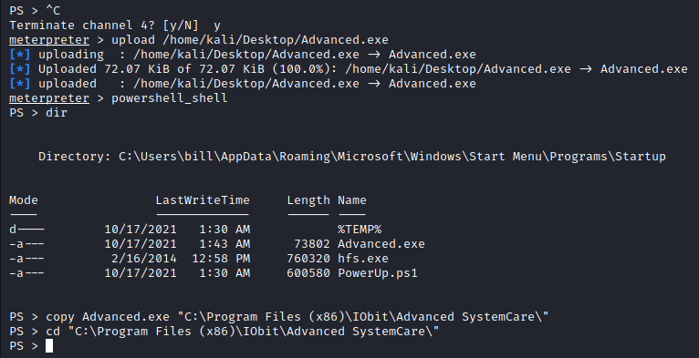

A quick note, the above image is incorrect the correct location to place the payload is one folder down in the IObit directory, this way the service picks up the payload first.

Now to stop and start the service

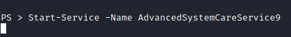

Now we get a connection on our listener!

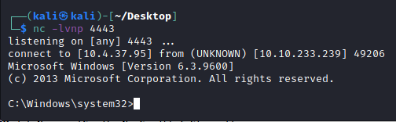

We are system!

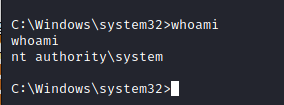

Now to hunt for the flag :)

Here we go! In the administrator's profile.

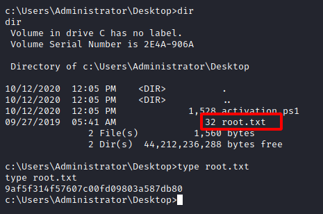

That's it for this CTF!