TomGhost Room

# TomGhost Room

Identify recent vulnerabilities to try exploit the system or read files that you should not have access to.

This room doesn't have any further information other than the description above. It has two flags user.txt and root.txt

## Tools:

I used the following tools in the CTF.

- Kali Linux
- Nmap
- AjpShooter
- John

## Write Up

Note: I'll set the IP of the server in my host file to tomghost.thm on my attack box.

### Recon:

I'll start with NMAP:

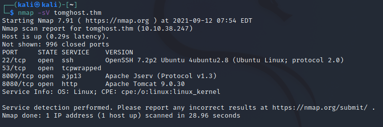

We can see a few services running on the target.

Looks like we have tomcat running on port 8080

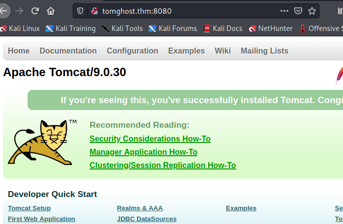

Looking around I tried the /manager path, but it I don't have access, it seems to be blocked to the localhost only.

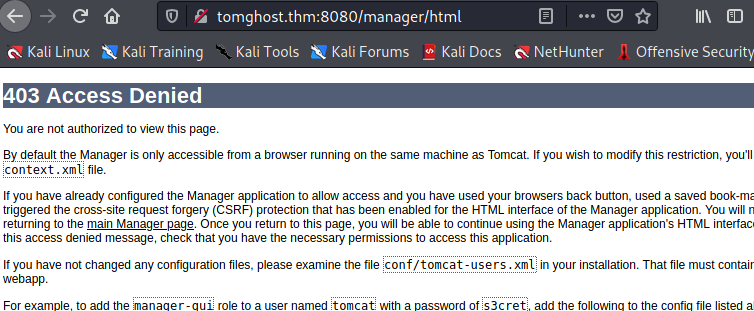

Nmap - vulns script didn't find much interesting

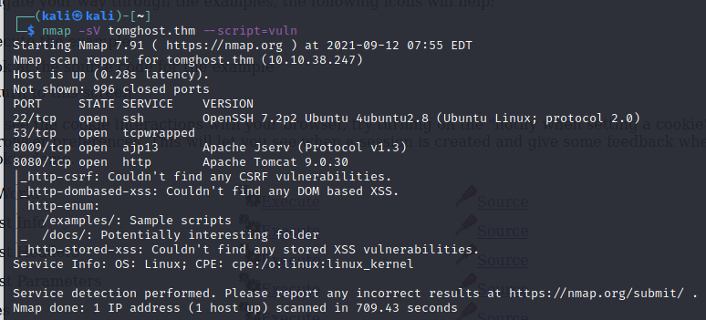

Doing some research about tomcat 9.03 I came across this article advising that the port 8009 might be vulnerable with CVE-202-1938

https://blog.qualys.com/product-tech/2020/03/10/detect-apache-tomcat-ajp-file-inclusion-vulnerability-cve-2020-1938-using-qualys-was

I'll see if I can find any exploits. Further research led me to ajpShooter.py which exploits this vulnerability.

Downloading the code from here: https://raw.githubusercontent.com/00theway/Ghostcat-CNVD-2020-10487/master/ajpShooter.py

I've saved it on my attack box and will try it out.

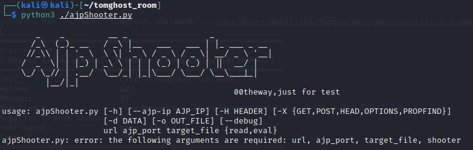

### Exploitation:

Following the instructions on the github page I run the following:

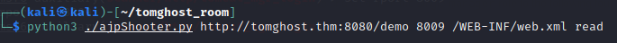

This gives me some nice results:


That looks like a possible username / password combo.

skyfuck:8730281lkjlkjdqlksalks

The only place to login on this machine is SSH, as the tomcat login portal is blocked to localhost.

So I'll try that first.

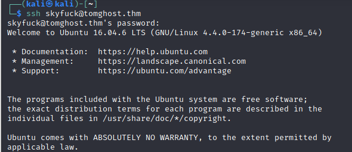

And we're in with a user!

Having a quick look, it seems we have an encrypted file here with pgp, and the key right next to it.

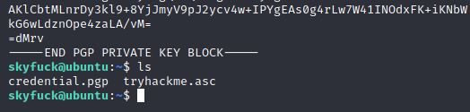

I imported the key and tried to decrypt it but the password I have doesn't work.

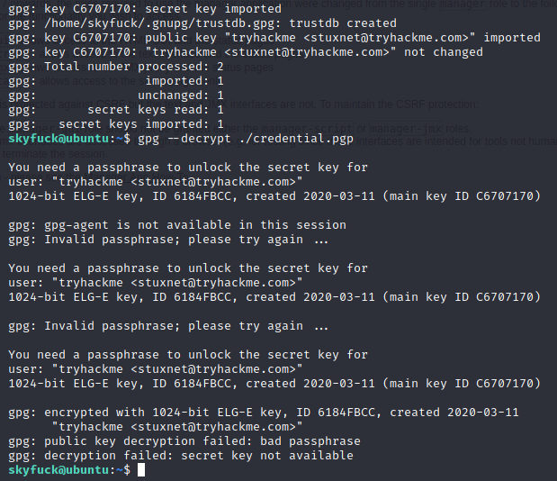

So I'll try and brute force it with out rockyou.txt password list.

Following the instructions on the site below, I'll use john to attempt the brute force attack on the key.

https://www.ubuntuvibes.com/2012/10/recover-your-gpg-passphrase-using-john.html

This was successful as we can see

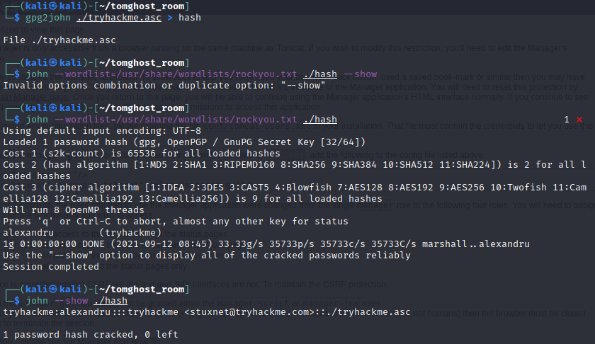

The password is: alexandru

I'll try and decrypt the file now on the target machine.

And here we have another account:

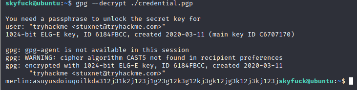

merlin:asuyusdoiuqoilkda312j31k2j123j1g23g12k3g12kj3gk12jg3k12j3kj123j

Before trying those credentials I had a quick hunt around the server and found the first flag in merlin's home folder.

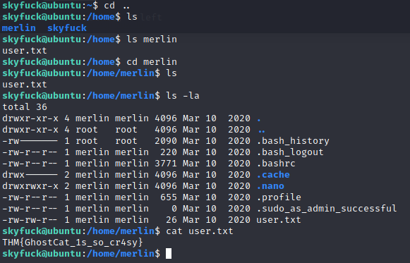

It also looks lie merlin might be a sudo user. Which could be interesting. I'll try login to another ssh session with those credentials to see what I can do from there.

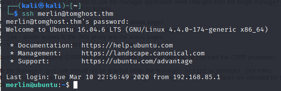

Now I'm in as merlin.

### Privilege Escalation

Looks like merlin can run zip as root.

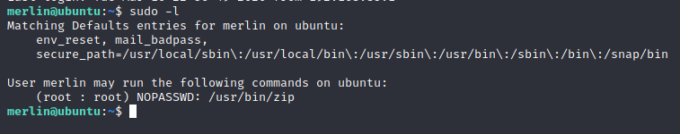

Referring to this site: https://gtfobins.github.io/gtfobins/zip/

I may have found some priv escalation options.

The code snippet is:

```
TF=$(mktemp -u)
sudo zip $TF /etc/hosts -T -TT 'sh #'
sudo rm $TF
```

And here we have it:

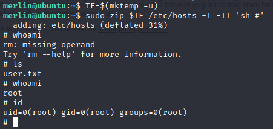

Now for the root flag

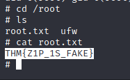