# Simple CTF

This is a simple CTF room.

Let's start with an Nmap scan.

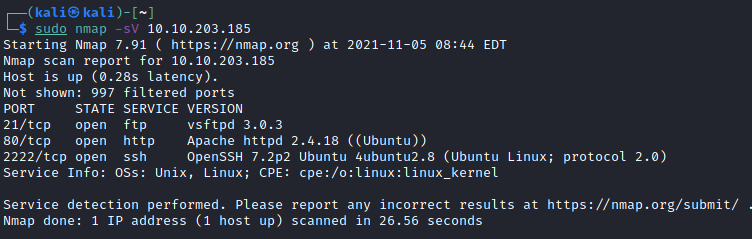

We can see a few ports open here and ssh running on port 2222.

I'll check for vulnerabilities with an nmap scan.

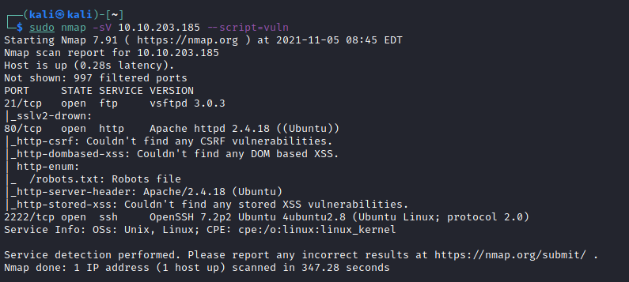

We note a robots.txt file, so we can look at that.

First I'll check out the website.

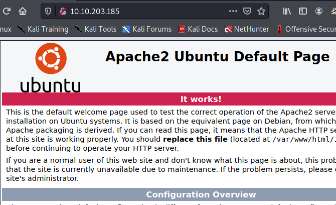

We get the default Apache2 page.

Now the robots.txt, looks like it has some interesting information. A potential user name 'mike' and a folder.

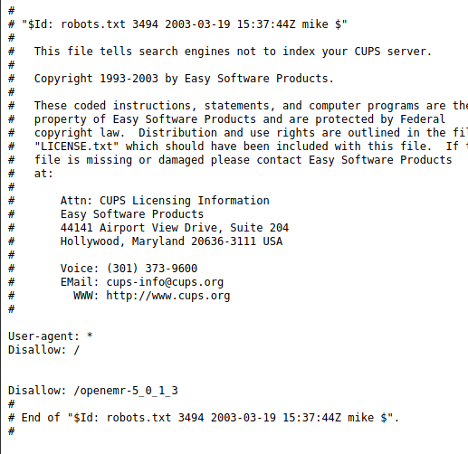

The openemr folder didn't load anything.

So I'll kick of a gobuster directory scan.

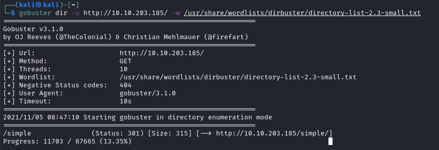

We've found a folder /simple

This leads to a CSM called CMS made simple.

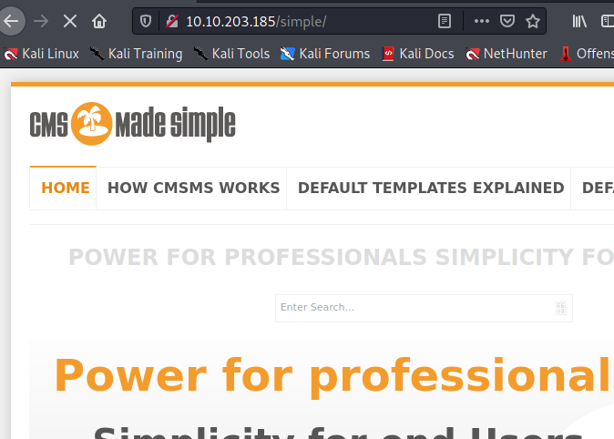

The version is listed at the bottom of a page

A quick google takes us to the exploitdb with a SQL injection vulnerability.

https://www.exploit-db.com/exploits/46635

The vulnerability is CVE-2019-9053

I've copied the exploit onto my attack box and will try it out.

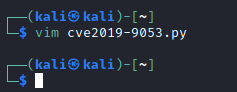

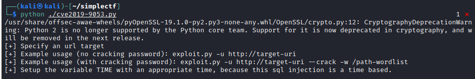

I'll try it out with my a short password list - fasttrack

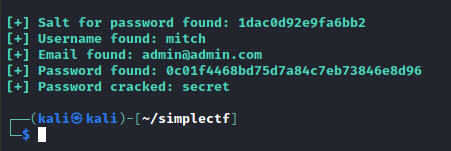

We got some good results here.

Now to try this to login, I'll go for ssh first.

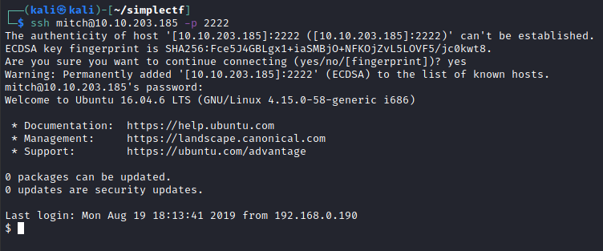

We're in as mitch!

And we have out user flag.

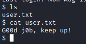

I'll check out sudo now.

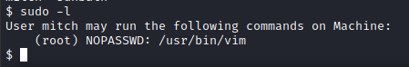

Looks like I can run vim as sudo, so will try and spawn a shell from vim.

Here we are in vim as sudo, I'll run the following vim command.

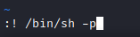

And here we have it, i am root!

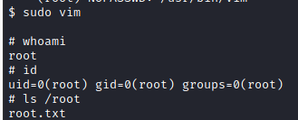

And now for the flag!

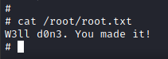

That's it for this one.